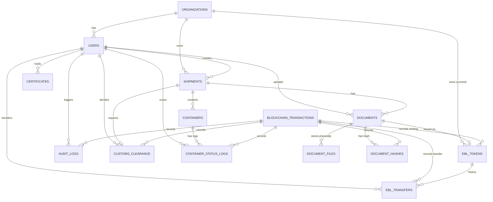

# Entity Relationship Diagram (ERD) - PortChain

Berdasarkan struktur data yang diajukan, berikut adalah diagram relasi entitas untuk penyimpanan *Off-Chain* di PostgreSQL. Terdapat **14 Entitas** yang saling berhubungan.

## Daftar 14 Entitas:

1. **Organizations**: `organization_id` (PK), `organization_name`, `organization_type`.
2. **Users**: `user_id` (PK), `organization_id` (FK), `full_name`, `email`, `password_hash`, `role_name`, `is_active`.
3. **Shipments**: `shipment_id` (PK), `organization_id` (FK), `created_by` (FK), `shipment_code`, ports, vessel.
4. **Containers**: `container_id` (PK), `shipment_id` (FK), `container_number`, type, size, weight.
5. **Documents**: `document_id` (PK), `shipment_id` (FK), `uploaded_by` (FK), type, status.
6. **Document Files**: `file_id` (PK), `document_id` (FK), path, `is_encrypted`, AES-256.
7. **Document Hashes**: `document_hash_id` (PK), `document_id` (FK), `blockchain_tx_id` (FK).
8. **Blockchain Transactions**: `blockchain_tx_id` (PK), channel, chaincode, block, `tx_id`.
9. **Audit Logs**: `audit_log_id` (PK), `user_id` (FK), `blockchain_tx_id` (FK), old/new value.
10. **Customs Clearance**: `customs_clearance_id` (PK), `shipment_id` (FK), `decided_by` (FK), `blockchain_tx_id` (FK), status, lane.
11. **Container Status Logs**: `status_log_id` (PK), `container_id` (FK), `scanned_by` (FK), `blockchain_tx_id` (FK).
12. **Certificates**: `certificate_id` (PK), `user_id` (FK), valid from/until.
13. **EBL Tokens**: `ebl_token_id` (PK), `document_id` (FK), `current_owner_org_id` (FK), `blockchain_tx_id` (FK).
14. **EBL Transfers**: `ebl_transfer_id` (PK), `ebl_token_id` (FK), `from/to_org_id` (FK), `transferred_by` (FK), `blockchain_tx_id` (FK).

---

## 🔍 Data Flow untuk Public Tracking Dashboard

Pada pembaruan fitur **Public Tracking Dashboard**, sistem akan menarik (*query*) data secara kronologis dari 5 entitas utama berikut untuk membangun *timeline* perjalanan dokumen dan pengiriman secara transparan bagi publik:

1. **Shipments (`created_at`)**: Titik awal (*Origin*). Sistem mengambil tanggal kapan pengiriman didaftarkan.
2. **Documents (`uploaded_at`)**: Pengunggahan dokumen fisik (seperti *Bill of Lading* asli).
3. **Customs Clearance (`decided_at`)**: Mencatat status verifikasi dari otoritas kepabeanan (Bea Cukai).
4. **EBL Tokens (`issued_at`)**: Pencetakan (*Minting*) token *Electronic Bill of Lading* secara digital.
5. **EBL Transfers (`transferred_at`)**: Riwayat perpindahan kepemilikan token e-BL antar organisasi (misalnya, perpindahan dari Port Authority ke sistem eksternal Bank).

Semua data ini dirajut (*joined*) menggunakan *foreign key* `shipment_id` dan `document_id`, lalu direvalidasi melalui relasi ke tabel **Blockchain Transactions** untuk memastikan keabsahan tiap langkah.
