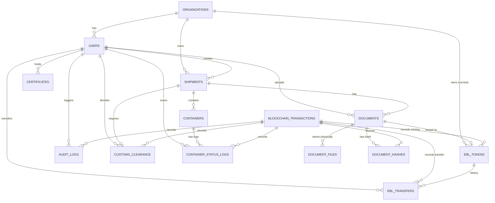

# Entity Relationship Diagram (ERD) - PortChain

Berdasarkan struktur data yang diajukan, berikut adalah diagram relasi entitas untuk penyimpanan *Off-Chain* di PostgreSQL. Terdapat **14 Entitas** yang saling berhubungan.

## Daftar 14 Entitas:

1. **Organizations**: `organization_id` (PK), name, type.
2. **Users**: `user_id` (PK), `organization_id` (FK), name, email.
3. **Shipments**: `shipment_id` (PK), `organization_id` (FK), `created_by` (FK), ports, vessel.
4. **Containers**: `container_id` (PK), `shipment_id` (FK), weight, size.
5. **Documents**: `document_id` (PK), `shipment_id` (FK), `uploaded_by` (FK), status.
6. **Document Files**: `file_id` (PK), `document_id` (FK), path, `is_encrypted`, AES-256.
7. **Document Hashes**: `document_hash_id` (PK), `document_id` (FK), `blockchain_tx_id` (FK).
8. **Blockchain Transactions**: `blockchain_tx_id` (PK), channel, chaincode, block.
9. **Audit Logs**: `audit_log_id` (PK), `user_id` (FK), `blockchain_tx_id` (FK), old/new value.
10. **Customs Clearance**: `customs_clearance_id` (PK), `shipment_id` (FK), `decided_by` (FK), `blockchain_tx_id` (FK).
11. **Container Status Logs**: `status_log_id` (PK), `container_id` (FK), `scanned_by` (FK), `blockchain_tx_id` (FK).
12. **Certificates**: `certificate_id` (PK), `user_id` (FK), valid from/until.
13. **EBL Tokens**: `ebl_token_id` (PK), `document_id` (FK), `current_owner_org_id` (FK), `blockchain_tx_id` (FK).
14. **EBL Transfers**: `ebl_transfer_id` (PK), `ebl_token_id` (FK), `from/to_org_id` (FK), `transferred_by` (FK), `blockchain_tx_id` (FK).
